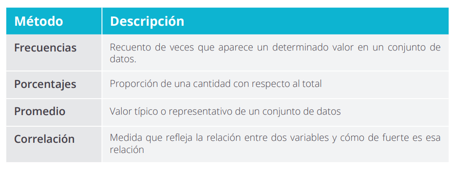

# Análisis principal

Cuando nos hayamos familiarizado con los datos y los conozcamos suficientemente daremos paso al análisis principal. En esta ocasión sí partimos\
con un **objetivo y pregunta clara** a la que queremos dar respuesta. Es por ello por lo que este análisis está mucho más dirigido y debe de haberse fijado de antemano el método a emplear. Existen varios métodos estadísticos básicos y que pueden ser usados en múltiples contextos.

Una cuestión que no debe pasarse por alto en este análisis es la **validación por parte de expertos**. Si estamos analizando la evolución del número de matriculaciones de nuestro centro, una vez tengamos los resultados debemos consultar con la persona responsable para que no solo nos confirme si existen errores en el análisis y sus resultados, sino que nos ofrezca una lectura valiosa de los mismos.

<figure><figcaption></figcaption></figure>
