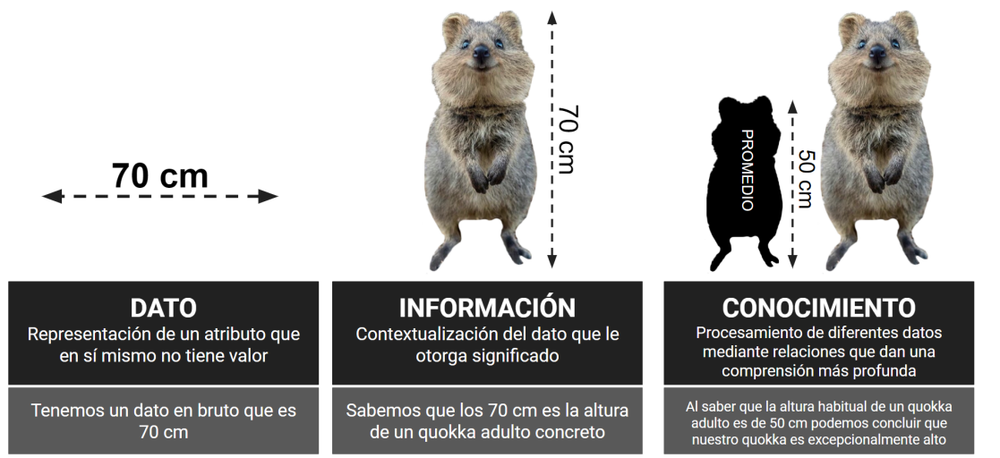

# El valor de los datos

Llegados a este punto, y antes de continuar, conviene que ilustremos mejor la distinción entre tres conceptos clave que ya han aparecido y que a menudo se usan de forma indistinta. Se trata del dato, la información y el conocimiento. Consideremos para ello el valor “70 cm”. Aislado, este número es simplemente un dato sin contexto. Pero si especificamos que “70 cm” es la altura de un quokka adulto, el dato se convierte en información que nos permite contextualizar un hecho, en este caso la altura de un marsupial concreto. Si además se entiende que un quokka de esa altura es más grande que la mayoría y, por ende, es una rareza o excepción dentro de su especie, hemos adquirido un conocimiento específico sobre el quokka. Esta progresión desde un simple dato hasta una comprensión más profunda ilustra la importancia de interpretar y contextualizar adecuadamente los datos.

<figure><figcaption></figcaption></figure>

La complejidad al transformar datos en información útil y luego en conocimiento significa que no es simplemente una cuestión de interpretación.\
Requiere procesos meticulosos y herramientas adecuadas para extraer significado y valor.

Dicho esto, y considerando la importancia de procesar adecuadamente estos datos, en la era moderna, el término big data se ha vuelto cada vez más familiar. Se refiere a enormes conjuntos de datos que superan la capacidad de procesamiento de sistemas tradicionales, demandando nuevas técnicas y herramientas para su análisis.

Esta emergencia del big data ejemplifica cómo la problemática de gestionar grandes volúmenes de datos ha evolucionado con el tiempo.

Lo que una vez fue considerado un desafío casi insuperable, ahora es parte de nuestra rutina diaria gracias a los avances tecnológicos. Pero,\
es esencial destacar que la capacidad de extraer información no se limita únicamente a estos enormes conjuntos de datos. Ya sea en el ámbito del big data o en escalas menores, ahora podemos obtener, procesar y analizar información de manera eficiente. Lo que hasta hace muy poco era inabarcable, se ha convertido en una cuestión cotidiana. Estamos en una época en la que, independientemente del tamaño de los datos, tenemos el poder y las herramientas para transformarlos en conocimientos valiosos.

### Terminos

\
• **Nube**: Servidor conectado a internet donde guardamos y accedemos a información o programas sin necesidad de tenerlos o procesarlos en nuestro ordenador.

\
• **Big data**: Término que hace referencia a una gran cantidad de datos que es complicada de manejar con herramientas normales.\

• **Dataset**: Conjunto de datos recopilados en uno o varios archivos.\

• **Repositorio**: Archivo digital donde se guardan y organizan archivos o programas para que sean accesibles a otras personas.\

• **Curación de datos**: Proceso de organizar, corregir y mejorar datos para que estén listos para ser usados.\

• **Minería de datos**: Proceso de buscar patrones o información útil en una gran cantidad de datos.
