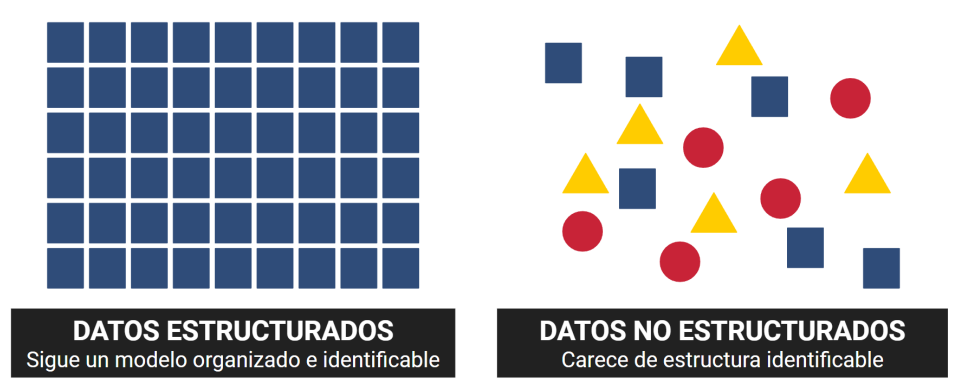
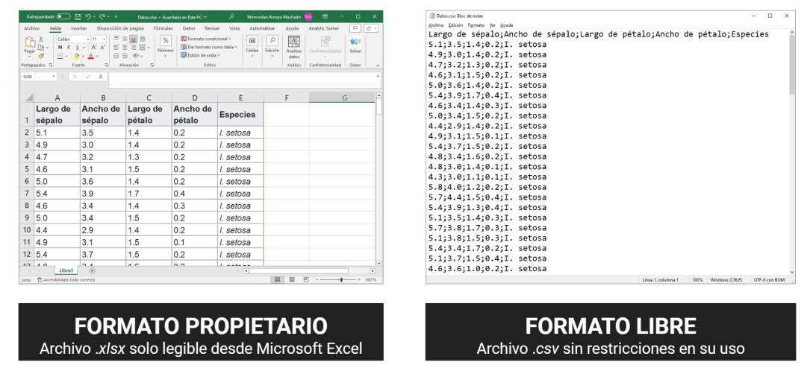

# Los datos y sus formatos

Si múltiples son las operaciones que entran dentro de la ciencia de datos, también lo son los propios datos. Una distinción básica en este sentido es la que podemos hacer entre datos estructurados y no estructurados. Los primeros son rápidamente reconocibles, pues muestran una organización y estructura fácilmente comprensible e interpretable. Por ejemplo, volviendo a la película de antes, una tabla de datos de jugadores de béisbol en la que cada fila es un jugador y cada columna un atributo de este, como la velocidad o fuerza de lanzamiento. Por su parte, los datos no estructurados combinan diferentes formatos y contenidos sin seguir una estructura tan clara y evidente. Por ejemplo, un video tiene varios componentes, principalmente imágenes y sonido, y estos no tienen una estructura simple como la de tabla, sino que es mucho más compleja.

El caso estándar en la ciencia de datos parte de datos estructurados. De este modo, se suele trabajar con datos que siguen un modelo de tabla. Esto es claramente apreciable con las hojas de cálculo de programas como Microsoft Excel, desde las cuales es posible además llevar a cabo muchos de los procesos básicos de la ciencia de datos, inclusive la visualización mediante gráficos. Eso sí, aunque se trabaje con datos estructurados en tablas estos pueden estar almacenados en diferentes formatos de archivo, como el propio archivo de Microsoft Excel (archivos .xls o .xlsx). No obstante, cabe destacar que este es un formato denominado propietario, lo que quiere decir que sin haber adquirido una licencia de Microsoft Excel no se puede usar esta herramienta y acceder a ellos, algo que puede impedir su uso a otras personas que no dispongan de esta herramienta. Afortunadamente, existen los conocidos.

como formatos abiertos y que permiten solucionar esta limitación. El formato abierto básico para los datos estructurados es el archivo de texto plano (.txt). En este archivo los datos pueden organizarse en forma de tabla con cada caso o individuo (los jugadores de béisbol) representado en una línea de texto, mientras que cada atributo o variable (velocidad, fuerza de lanzamiento…) se separa con un carácter específico conocido como delimitador. \

Habitualmente se emplea la coma, punto y coma, o tabulación. Dependiendo del carácter delimitador utilizado, podemos transformar el archivo de texto en un archivo de valores delimitados por comas (.csv) o por tabulaciones (.tsv). Ambos formatos son estándares en la ciencia de datos, y es común almacenar y compartir datos en estos formatos.

&#x20;La ventaja en ello está en que todas las personas, con independencia de si usan Microsoft Excel, Google Spreadsheet, Numbers o cualquier herramienta de hojas de cálculo, van a poder hacer uso de esos datos sin ninguna limitación.

<figure><figcaption></figcaption></figure>

\
El formato abierto básico para los datos estructurados es el archivo de texto plano (.txt). En este archivo los datos pueden organizarse en forma de tabla con cada caso o individuo (los jugadores de béisbol) representado en una línea de texto, mientras que cada atributo o variable (velocidad, fuerza de lanzamiento…) se separa con un carácter específico conocido como delimitador.&#x20;

Habitualmente se emplea la coma, punto y coma, o tabulación. Dependiendo del carácter delimitador utilizado, podemos transformar el archivo de texto en un archivo de valores delimitados por comas (.csv) o por tabulaciones (.tsv). Ambos formatos son estándares en la ciencia de datos, y es común almacenar y compartir datos en estos formatos. La ventaja en ello está en que todas las personas, con independencia de si usan Microsoft Excel, Google Spreadsheet, Numbers o cualquier herramienta de hojas de cálculo, van a poder hacer uso\
de esos datos sin ninguna limitación.

<figure><figcaption></figcaption></figure>
