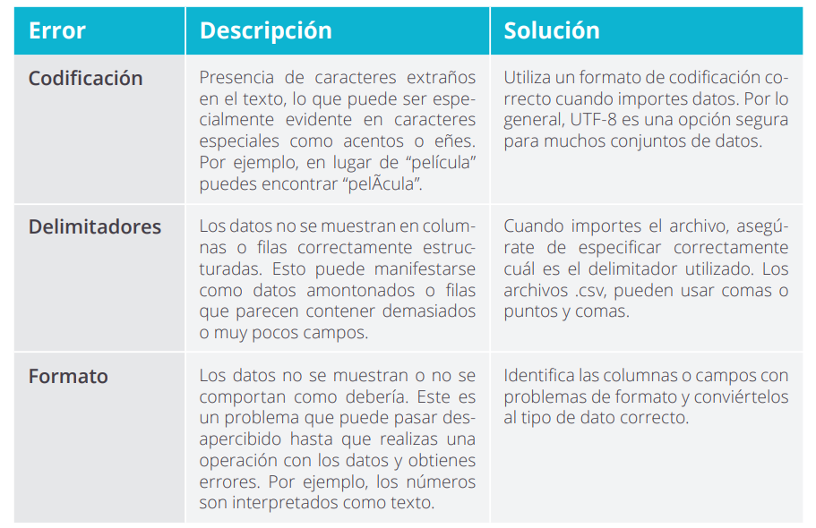

# Importación de datos

La fase de importación de datos de un archivo de texto a una hoja de cálculo es uno de los momentos más sensibles, ya que fácilmente puede introducir problemas en los datos que afecten a su análisis si no se realiza con precaución. La solución de estos problemas es muy sencilla, pues solo hay que repetir la importación para revisar y corregir los parámetros de importación.

Los problemas más frecuentes y que debemos considerar siempre son los siguientes:

<figure><figcaption></figcaption></figure>
