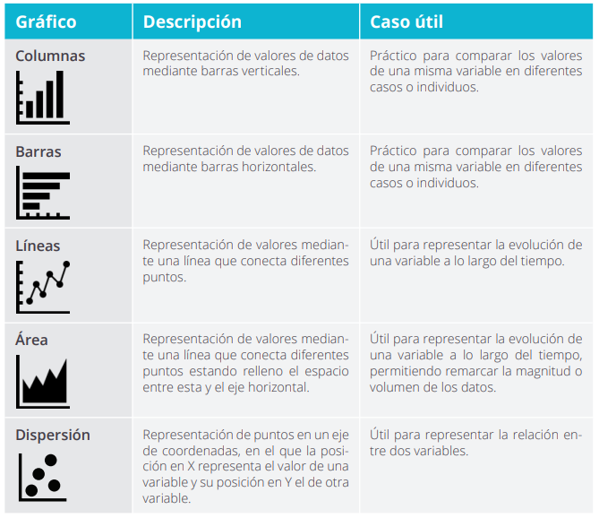

# Elaboración de visualizaciones

La visualización de datos es un instrumento indispensable en la ciencia de datos y cuya elaboración se realiza al mismo tiempo que el análisis,\
pudiendo ser el principal resultado incluso una visualización. Sin embargo, para que las visualizaciones tengan este poder y resulten reveladoras, es necesaria su correcta elaboración. En el terreno de las visualizaciones entran en juego numerosos elementos que no han de descuidarse para conseguir que aquello que estamos representando sea comprensible con solo una mirada. La correcta elección del tipo de gráfico, el uso de colores distinguibles o evitar el exceso de información son elementos clave para facilitar dicha lectura. En todo momento debemos tratar de hacer que la visualización sea auto explicativa apoyándonos\
en todos los elementos que tenemos a nuestro alcance al construirla, anteponiendo siempre la sencillez.

Algunos de los gráficos más utilizados son los siguientes, siendo cada uno de ellos idóneo para casos distintos.

<figure><figcaption></figcaption></figure>

### Writing content

GitBook offers a range of block types for you to add to your content inline — from simple text and tables, to code blocks and more. These elements will make your pages more useful to readers, and offer extra information and context.

Either start typing below, or press `/` to see a list of the blocks you can insert into your page.

### Add a new block



#### Open the insert block menu

Press `/` on your keyboard to open the insert block menu.



#### Search for the block you need

Try searching for “Stepper”, for exampe, to insert the stepper block.



#### Insert and edit your block

Click or press Enter to insert your block. From here, you’ll be able to edit it as needed.


